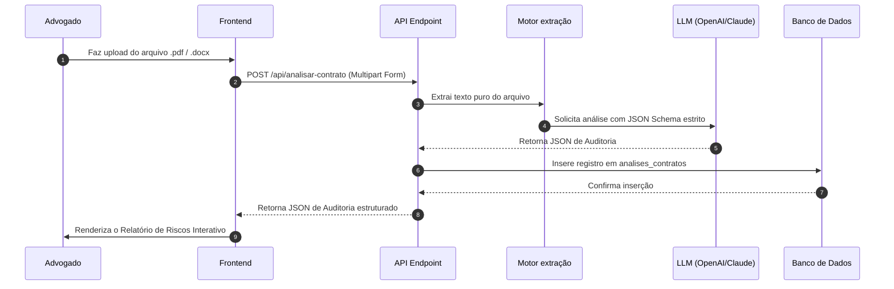

# POP de Arquitetura — Analista de Riscos de Contratos (V.L.A.E.G)

Este documento define o fluxo operacional e arquitetura técnica do módulo **Analista de Riscos de Contratos** para o Micro SaaS de Advogados.

---

## 1. Visão (Value Proposition & UX Core)
O Analista de Riscos permite que o advogado faça upload de contratos complexos (PDF/Docx) e obtenha uma auditoria imediata baseada em Inteligência Artificial. A ferramenta identifica cláusulas de risco ocultas, avalia o nível de exposição e propõe redações alternativas baseadas em melhores práticas de direito contratual, reduzindo o tempo de revisão manual de horas para segundos.

---

## 2. Link (Integração & Rotas)
- **Rota do Frontend**: `/dashboard/contratos`
- **Tabela Relacionada**: `analises_contratos` (definida em [schema-contrato.ts](file:///c:/laragon/www/_CLIENTES/micro-saas-advogados/src/db/schemas/schema-contrato.ts))
- **Dependências de Integração**:
  - Middleware de Autenticação de Usuário (`src/db/schemas/schema-usuario.ts`).
  - API Endpoint local `/api/analisar-contrato` para upload e envio ao motor de IA.
  - Supabase Storage ou pasta local `.tmp/uploads` para processamento temporário do arquivo.

---

## 3. Arquitetura (Fluxo de Dados & APIs)
O fluxo de processamento de dados é 100% transacional e estruturado em 3FN:



### Estrutura do Campo `resultadoJson` (JSON Schema)
```json
{
  "tipo": "object",
  "properties": {
    "scoreGeral": { "type": "integer", "minimum": 0, "maximum": 100 },
    "riscos": {
      "type": "array",
      "items": {
        "type": "object",
        "properties": {
          "clausulaOriginal": { "type": "string" },
          "gravidade": { "type": "string", "enum": ["ALTO", "MEDIO", "BAIXO"] },
          "diagnostico": { "type": "string" },
          "sugestaoRedacao": { "type": "string" }
        },
        "required": ["clausulaOriginal", "gravidade", "diagnostico", "sugestaoRedacao"]
      }
    }
  },
  "required": ["scoreGeral", "riscos"]
}
```

---

## 4. Estilo (Design System Apple Clean)
- **Tipografia**: Títulos e métricas com fonte **Geist**, textos descritivos e cláusulas com **Inter**.
- **Cards**: Todos os blocos de cláusulas e riscos utilizam a classe `.squircle` com cantos suavizados por clip-path.
- **Cores de Alertas (Paleta Harmoniosa HSL)**:
  - **Risco Alto**: Texto `#E11D48` (Rose 600), Background `#FFF1F2` (Rose 50), Borda `#FFE4E6` (Rose 100).
  - **Risco Médio**: Texto `#D97706` (Amber 600), Background `#FEF3C7` (Amber 50), Borda `#FDE68A` (Amber 100).
  - **Risco Baixo**: Texto `#059669` (Emerald 600), Background `#ECFDF5` (Emerald 50), Borda `#D1FAE5` (Emerald 100).

---

## 5. Gatilho (UX Interactions & Micro-animations)
1. **Gatilho de Entrada**: O advogado arrasta o arquivo para uma dropzone premium com efeito hover translúcido (`backdrop-filter: blur(8px)`).
2. **Gatilho de Progresso**: Ao iniciar o upload, a dropzone é ocultada e um loader esquelético animado (Skeleton UI) com efeito pulse de 1.5s exibe os estágios: "Lendo documento...", "Analisando cláusulas...", "Gerando redações alternativas...".
3. **Gatilho de Entrega**: Ao receber a resposta da API, a transição fade-in de 400ms revela os cards de riscos organizados em uma Bento Grid contendo o Score Geral e a lista de riscos interativos.
