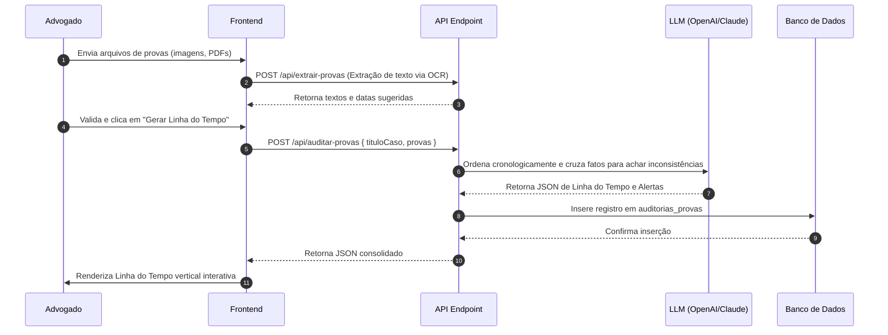

# POP de Arquitetura — Auditor de Provas (V.L.A.E.G)

Este documento define o fluxo operacional e arquitetura técnica do módulo **Auditor de Provas** para o Micro SaaS de Advogados.

---

## 1. Visão (Value Proposition & UX Core)
O Auditor de Provas resolve o desafio de organizar dezenas de evidências documentais (prints de WhatsApp, emails, recibos, fotos) trazidas pelos clientes. A ferramenta analisa os metadados e conteúdos das provas, ordena-os em uma linha do tempo lógica cronológica e destaca contradições materiais de datas ou fatos entre as provas, criando um dossiê pronto para instruir processos.

---

## 2. Link (Integração & Rotas)
- **Rota do Frontend**: `/dashboard/auditoria`
- **Tabela Relacionada**: `auditorias_provas` (definida em [schema-auditoria.ts](file:///c:/laragon/www/_CLIENTES/micro-saas-advogados/src/db/schemas/schema-auditoria.ts))
- **Dependências de Integração**:
  - Middleware de autenticação (`src/db/schemas/schema-usuario.ts`).
  - API Endpoint `/api/auditar-provas` para consolidação de metadados e conteúdos extraídos.
  - OCR (Optical Character Recognition) local ou externo para processamento de prints.

---

## 3. Arquitetura (Fluxo de Dados & APIs)
O sistema opera consolidando múltiplas entradas de mídia em um único JSON estruturado representando a linha de tempo:



### Estrutura do Campo `linhaTempoJson` (JSON Schema)
```json
{
  "type": "object",
  "properties": {
    "eventos": {
      "type": "array",
      "items": {
        "type": "object",
        "properties": {
          "dataHora": { "type": "string" },
          "descricao": { "type": "string" },
          "origem": { "type": "string", "description": "Arquivo de origem da prova" },
          "inconsistencia": { "type": ["string", "null"] }
        },
        "required": ["dataHora", "descricao", "origem"]
      }
    }
  },
  "required": ["eventos"]
}
```

---

## 4. Estilo (Design System Apple Clean)
- **Tipografia**: Datas em **Geist Mono** (garantindo alinhamento numérico), descrições de eventos em **Inter**.
- **Visual da Timeline**: Uma linha vertical sutil de `#E2E8F0` atravessa a tela. Cada nó (evento) é representado por um pequeno círculo com borda branca e fundo `#10B981` (Accent).
- **Cards de Detalhes**: Cards laterais com cantos suavizados pela classe `.squircle` e cor de fundo `#FFFFFF`.
- **Destaque de Inconsistências**: Nós que apresentarem inconsistências são pintados com cor de destaque Rose (`#EF4444`) e geram uma pulsação sutil na linha do tempo.

---

## 5. Gatilho (UX Interactions & Micro-animations)
1. **Gatilho de Entrada**: Upload múltiplo do tipo galeria, exibindo miniaturas dos arquivos enviados em uma grade com transição de entrada suave (scale-in de 150ms).
2. **Gatilho de Ordenação**: Ao clicar em "Gerar Linha do Tempo", os cards de provas flutuam visualmente até a linha central (animação de transição de posição CSS), ordenando-se sozinhos por ordem cronológica.
3. **Gatilho de Detalhes**: Clicar em qualquer evento da linha de tempo expande um card lateral com animação slide-left de 300ms, exibindo o conteúdo original da prova e quaisquer contradições apontadas pela IA.
