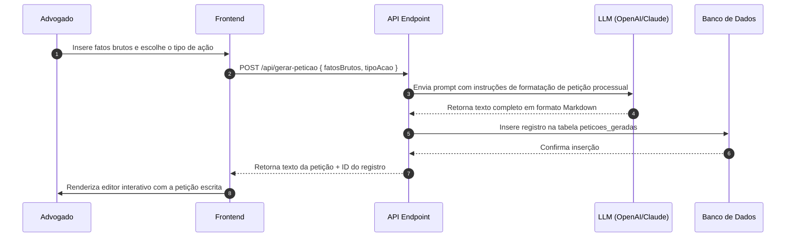

# POP de Arquitetura — Copiloto de Petições (V.L.A.E.G)

Este documento define o fluxo operacional e arquitetura técnica do módulo **Copiloto de Petições** para o Micro SaaS de Advogados.

---

## 1. Visão (Value Proposition & UX Core)
O Copiloto de Petições transforma fatos informais descritos de forma simples pelo advogado em petições iniciais completas, tecnicamente robustas e prontas para protocolo judicial. A ferramenta gera a estrutura de Fatos, Fundamentação Jurídica (Direito) e Pedidos, permitindo a edição direta e a exportação do documento gerado em formato editável.

---

## 2. Link (Integração & Rotas)
- **Rota do Frontend**: `/dashboard/peticoes`
- **Tabela Relacionada**: `peticoes_geradas` (definida em [schema-peticao.ts](file:///c:/laragon/www/_CLIENTES/micro-saas-advogados/src/db/schemas/schema-peticao.ts))
- **Dependências de Integração**:
  - Tabela de usuários para verificar cotas (`src/db/schemas/schema-usuario.ts`).
  - Endpoint de API `/api/gerar-peticao` para processamento do prompt e chamada do LLM.
  - Editor Rich Text (ou Markdown Viewer interativo) no frontend para refinamento.

---

## 3. Arquitetura (Fluxo de Dados & APIs)
O fluxo transacional garante que toda petição seja vinculada a um advogado autenticado para controle de histórico:



### Payloads da API
- **Request (POST `/api/gerar-peticao`)**:
  ```json
  {
    "fatosBrutos": "Cliente comprou um notebook online que chegou com defeito. A loja se recusa a trocar ou estornar o valor após 3 dias da entrega.",
    "tipoAcao": "Direito do Consumidor - Obrigação de Fazer c/c Danos Morais"
  }
  ```
- **Response**:
  ```json
  {
    "id": 102,
    "peticaoTexto": "# EXCELENTÍSSIMO SENHOR DOUTOR JUIZ DE DIREITO...\n\n## I. DOS FATOS...\n\n## II. DO DIREITO..."
  }
  ```

---

## 4. Estilo (Design System Apple Clean)
- **Tipografia**: O editor de texto utiliza **Inter** para o corpo do texto e **Geist Mono** para citações legais ou artigos de lei (como o Código de Defesa do Consumidor).
- **Interface da Folha**: A área de leitura/edição simula uma folha de papel física digital (A4) centralizada, utilizando cor de fundo `#FFFFFF`, borda sutil `#E2E8F0` com cantos `.squircle` e uma sombra suave premium (`box-shadow: 0 10px 40px -10px rgba(0, 0, 0, 0.04)`).
- **Inputs**: Inputs de texto com foco em borda `#10B981` (Accent) e fundo de contraste suave `#F9F9FB`.

---

## 5. Gatilho (UX Interactions & Micro-animations)
1. **Gatilho de Entrada**: Botão primário "Gerar Petição" apresenta efeito hover com sutil gradiente translúcido do azul Slate para o Emerald.
2. **Gatilho de Progresso**: Ao clicar, o botão principal exibe uma animação de progresso radial infinito (spinner de alta fidelidade) e o textarea de fatos é substituído por uma folha esquelética pulsante.
3. **Gatilho de Entrega**: Ao receber a resposta, o texto da petição é renderizado utilizando um efeito de digitação inteligente (streaming UI) com fade-in progressivo de seções de forma dinâmica, permitindo que o usuário veja a peça ser "redigida" na tela.
