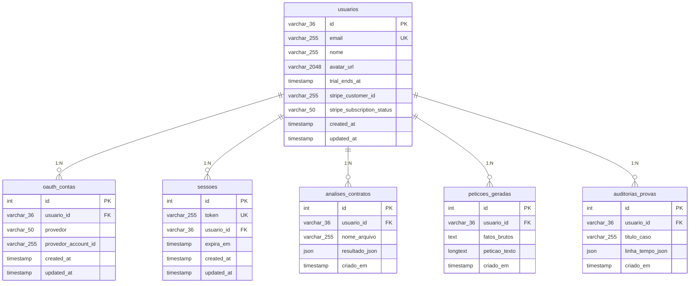

# DATA_DICTIONARY — JurisAI Master Data Dictionary

> Dicionário de Dados Centralizado — Governança Relacional e Metadados do Projeto.
> Fonte de verdade para tipagem, chaves, restrições e convenções de ambiente.
> Última atualização: 2026-05-21

---

## Metadados da Missão

| Campo                  | Valor                                                                 |
| ---------------------- | --------------------------------------------------------------------- |
| **Projeto**            | JurisAI — Micro-SaaS Jurídico de Auditoria Cognitiva para Advogados  |
| **Elite Architect**    | Murilo Germano Pessagno Brescia (Tech Lead)                           |
| **Execution Partner**  | Antigravity (AI Engineering Agent — Google DeepMind)                  |
| **Estágio Atual**      | Template Golden Bulletproof Nível 3 concluído                         |
| **ORM**                | Drizzle ORM v0.45+ sobre MySQL 8.x (Laragon local)                   |
| **Normalização**       | Terceira Forma Normal (3FN) estrita                                   |
| **Deploy**             | Netlify (SSG/SSR via Astro Adapter Node)                              |
| **CI/CD**              | GitHub Actions — Node 22 LTS, Corepack, PNPM v9 `--frozen-lockfile`  |

---

## Dicionário Relacional MySQL (Drizzle Schemas 3FN)

Todos os schemas residem em `src/db/schemas/` e são exportados via `src/db/index.ts`.
A conexão MySQL é estabelecida via `mysql2/promise` com variáveis de ambiente server-only.

---

### Tabela `usuarios`

**Schema**: [`schema-usuario.ts`](file:///c:/laragon/www/_CLIENTES/micro-saas-advogados/src/db/schemas/schema-usuario.ts)
**Propósito**: Registro central de advogados. Controle de dados cadastrais e ciclo de trial de 7 dias.

| Coluna | Tipo Drizzle | Tipo MySQL | Constraints |
| :--- | :--- | :--- | :--- |
| `id` | `varchar('id', { length: 36 })` | `VARCHAR(36)` | `PRIMARY KEY` |
| `email` | `varchar('email', { length: 255 })` | `VARCHAR(255)` | `NOT NULL`, `UNIQUE` |
| `nome` | `varchar('nome', { length: 255 })` | `VARCHAR(255)` | `NOT NULL` |
| `avatar_url` | `varchar('avatar_url', { length: 2048 })` | `VARCHAR(2048)` | `NULLABLE` |
| `trial_ends_at` | `timestamp('trial_ends_at')` | `TIMESTAMP` | `NULLABLE` |
| `stripe_customer_id` | `varchar('stripe_customer_id', { length: 255 })` | `VARCHAR(255)` | `NULLABLE` |
| `stripe_subscription_status` | `varchar('stripe_subscription_status', { length: 50 })` | `VARCHAR(50)` | `NULLABLE` |
| `created_at` | `timestamp('created_at')` | `TIMESTAMP` | `NOT NULL`, `DEFAULT CURRENT_TIMESTAMP` |
| `updated_at` | `timestamp('updated_at')` | `TIMESTAMP` | `NOT NULL`, `DEFAULT CURRENT_TIMESTAMP` |

**Observações**:
- O `id` é um UUID v4 gerado pela aplicação (não auto-increment), formato `varchar(36)`.
- O status do usuário é inferido pelo `trial_ends_at` e `stripe_subscription_status` em vez de um ENUM simples, dando maior flexibilidade para integração financeira.
- Todas as demais tabelas referenciam `usuarios.id` como foreign key.

---

### Tabela `oauth_contas`

**Schema**: [`schema-oauth.ts`](file:///c:/laragon/www/_CLIENTES/micro-saas-advogados/src/db/schemas/schema-oauth.ts)
**Propósito**: Vínculos com provedores de autenticação social (Google, Apple). Isolamento 3FN.

| Coluna | Tipo Drizzle | Tipo MySQL | Constraints |
| :--- | :--- | :--- | :--- |
| `id` | `int('id')` | `INT` | `PRIMARY KEY`, `AUTO_INCREMENT` |
| `usuario_id` | `varchar('usuario_id', { length: 36 })` | `VARCHAR(36)` | `NOT NULL`, `FK → usuarios.id ON DELETE CASCADE` |
| `provedor` | `varchar('provedor', { length: 50 })` | `VARCHAR(50)` | `NOT NULL` (ex: 'google' \| 'apple') |
| `provedor_account_id` | `varchar('provedor_account_id', { length: 255 })` | `VARCHAR(255)` | `NOT NULL` |
| `created_at` | `timestamp('created_at')` | `TIMESTAMP` | `NOT NULL`, `DEFAULT CURRENT_TIMESTAMP` |
| `updated_at` | `timestamp('updated_at')` | `TIMESTAMP` | `NOT NULL`, `DEFAULT CURRENT_TIMESTAMP` |

**Índices**:
- `provedor_account_idx`: `UNIQUE INDEX` composto em `(provedor, provedor_account_id)` — impede duplicação de credenciais sociais.

**Observações**:
- Cada provedor (Google, Apple) gera um registro isolado nesta tabela.
- O `ON DELETE CASCADE` garante limpeza automática ao remover o usuário pai.

---

### Tabela `sessoes`

**Schema**: [`schema-sessao.ts`](file:///c:/laragon/www/_CLIENTES/micro-saas-advogados/src/db/schemas/schema-sessao.ts)
**Propósito**: Controle de sessões de login seguras, tokens e expiração.

| Coluna | Tipo Drizzle | Tipo MySQL | Constraints |
| :--- | :--- | :--- | :--- |
| `id` | `int('id')` | `INT` | `PRIMARY KEY`, `AUTO_INCREMENT` |
| `token` | `varchar('token', { length: 255 })` | `VARCHAR(255)` | `NOT NULL`, `UNIQUE` |
| `usuario_id` | `varchar('usuario_id', { length: 36 })` | `VARCHAR(36)` | `NOT NULL`, `FK → usuarios.id ON DELETE CASCADE` |
| `expira_em` | `timestamp('expira_em')` | `TIMESTAMP` | `NOT NULL` |
| `created_at` | `timestamp('created_at')` | `TIMESTAMP` | `NOT NULL`, `DEFAULT CURRENT_TIMESTAMP` |
| `updated_at` | `timestamp('updated_at')` | `TIMESTAMP` | `NOT NULL`, `DEFAULT CURRENT_TIMESTAMP` |

**Observações**:
- O token é um hash seguro gerado server-side, nunca exposto ao cliente via `PUBLIC_`.
- Sessões expiradas devem ser podadas por cron job ou middleware de verificação.

---

### Tabela `analises_contratos`

**Schema**: [`schema-contrato.ts`](file:///c:/laragon/www/_CLIENTES/micro-saas-advogados/src/db/schemas/schema-contrato.ts)
**Propósito**: Relatórios de auditoria de contratos gerados pelo Engine 01 — Analista de Riscos.

| Coluna | Tipo Drizzle | Tipo MySQL | Constraints |
| :--- | :--- | :--- | :--- |
| `id` | `int('id')` | `INT` | `PRIMARY KEY`, `AUTO_INCREMENT` |
| `usuario_id` | `varchar('usuario_id', { length: 36 })` | `VARCHAR(36)` | `NOT NULL`, `FK → usuarios.id ON DELETE CASCADE` |
| `nome_arquivo` | `varchar('nome_arquivo', { length: 255 })` | `VARCHAR(255)` | `NOT NULL` |
| `resultado_json` | `json('resultado_json')` | `JSON` | `NOT NULL` |
| `criado_em` | `timestamp('criado_em')` | `TIMESTAMP` | `NOT NULL`, `DEFAULT CURRENT_TIMESTAMP` |

**Observações**:
- `resultado_json` armazena o mapeamento dos passivos detectados e o nível de risco graduado identificado pelo modelo cognitivo.

---

### Tabela `peticoes_geradas`

**Schema**: [`schema-peticao.ts`](file:///c:/laragon/www/_CLIENTES/micro-saas-advogados/src/db/schemas/schema-peticao.ts)
**Propósito**: Armazenamento de fatos brutos e peças processuais finais em Markdown — Engine 02, Copiloto de Petições.

| Coluna | Tipo Drizzle | Tipo MySQL | Constraints |
| :--- | :--- | :--- | :--- |
| `id` | `int('id')` | `INT` | `PRIMARY KEY`, `AUTO_INCREMENT` |
| `usuario_id` | `varchar('usuario_id', { length: 36 })` | `VARCHAR(36)` | `NOT NULL`, `FK → usuarios.id ON DELETE CASCADE` |
| `fatos_brutos` | `text('fatos_brutos')` | `TEXT` | `NOT NULL` |
| `peticao_texto` | `longtext('peticao_texto')` | `LONGTEXT` | `NOT NULL` |
| `criado_em` | `timestamp('criado_em')` | `TIMESTAMP` | `NOT NULL`, `DEFAULT CURRENT_TIMESTAMP` |

**Observações**:
- `fatos_brutos` recebe a narrativa do advogado em formato de texto livre.
- `peticao_texto` contém a peça jurídica final estruturada segundo as normas do CPC.

---

### Tabela `auditorias_provas`

**Schema**: [`schema-auditoria.ts`](file:///c:/laragon/www/_CLIENTES/micro-saas-advogados/src/db/schemas/schema-auditoria.ts)
**Propósito**: Linha do tempo de evidências e inconsistências mapeadas — Engine 03, Auditor de Provas.

| Coluna | Tipo Drizzle | Tipo MySQL | Constraints |
| :--- | :--- | :--- | :--- |
| `id` | `int('id')` | `INT` | `PRIMARY KEY`, `AUTO_INCREMENT` |
| `usuario_id` | `varchar('usuario_id', { length: 36 })` | `VARCHAR(36)` | `NOT NULL`, `FK → usuarios.id ON DELETE CASCADE` |
| `titulo_caso` | `varchar('titulo_caso', { length: 255 })` | `VARCHAR(255)` | `NOT NULL` |
| `linha_tempo_json` | `json('linha_tempo_json')` | `JSON` | `NOT NULL` |
| `criado_em` | `timestamp('criado_em')` | `TIMESTAMP` | `NOT NULL`, `DEFAULT CURRENT_TIMESTAMP` |

**Observações**:
- `linha_tempo_json` armazena a cronologia factual de evidências e divergências detectadas em mídias, depoimentos e documentos anexados.

---

## Diagrama Entidade-Relacionamento



---

## Mapeamento de Variáveis de Ambiente

### Convenção de Escopo Seguro

| Prefixo     | Escopo                   | Visibilidade                     |
| ----------- | ------------------------ | -------------------------------- |
| (sem prefixo) | Server-only (padrão)  | Acessível apenas no frontmatter Astro e endpoints server-side |
| `PUBLIC_`   | Client-side             | Exposta ao navegador via `import.meta.env.PUBLIC_*` |

### Variáveis Ativas

| Variável          | Escopo     | Propósito                                  |
| ----------------- | ---------- | ------------------------------------------ |
| `DATABASE_URL`    | Server     | URI de conexão do MySQL (contendo user, pass, host, port, db) |

### Regras Invioláveis

1. **Nunca** expor `DATABASE_URL` ou secrets com o prefixo `PUBLIC_`.
2. **Nunca** commitar `.env` no repositório (protegido pelo `.gitignore`).
3. Variáveis `PUBLIC_` são exclusivas para dados de renderização de UI (ex: URLs de API pública, feature flags visuais).

---

## Conexão com o Banco de Dados

**Arquivo**: [`src/db/index.ts`](file:///c:/laragon/www/_CLIENTES/micro-saas-advogados/src/db/index.ts)

```typescript
import { drizzle } from 'drizzle-orm/mysql2';
import mysql from 'mysql2/promise';

const connectionString = import.meta.env.DATABASE_URL || process.env.DATABASE_URL;

if (!connectionString) {
  console.warn('[DB Config] Missing DATABASE_URL environment variable.');
}

const poolConnection = mysql.createPool({
  uri: connectionString ?? '',
  waitForConnections: true,
  connectionLimit: 10,
  queueLimit: 0,
});

export const db = drizzle(poolConnection);
```

- Driver: `mysql2/promise` (Connection Pool assíncrono nativo)
- ORM: Drizzle ORM com type-safety completa
- Conexão: Singleton exportado para consumo em endpoints e frontmatter Astro

---

*Documento gerado em 2026-05-21. Mantenedor: Elite Architect Murilo Brescia & Antigravity.*
